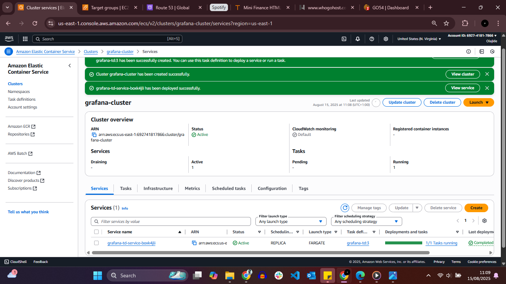
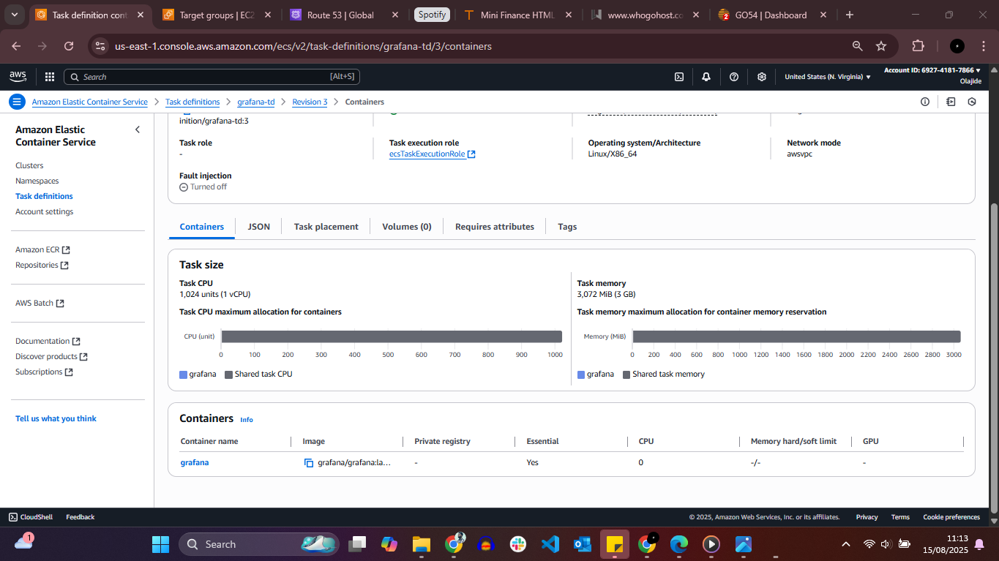
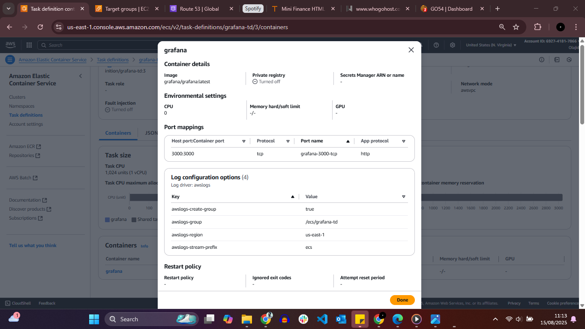
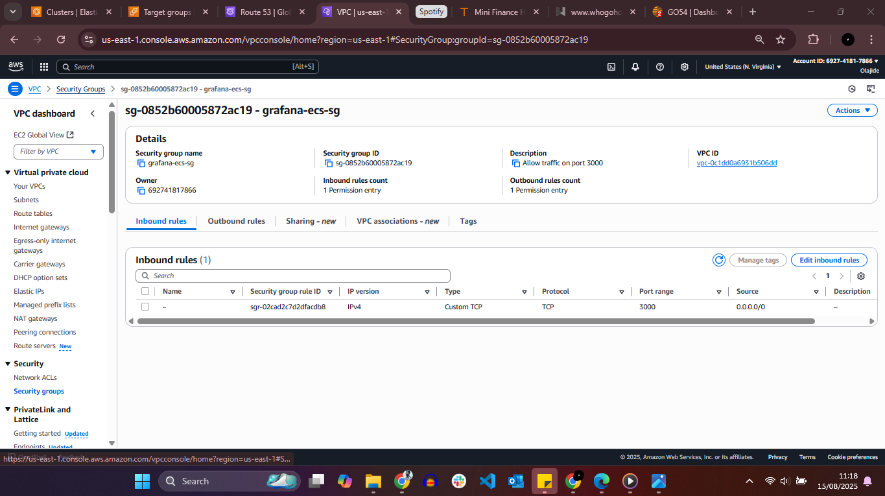

# Grafana Deployment on Amazon ECS (Fargate)

## 📌 Project Overview
This project demonstrates the deployment of **Grafana** on **Amazon Elastic Container Service (ECS)** using the **Fargate launch type**. The official Docker image `grafana/grafana` was used to run Grafana as a containerized application without managing underlying infrastructure.

The service was deployed in a public subnet with a public IP for testing and secured using a security group that allows inbound access on port **3000**.

---

## 🧩 Architecture Diagram (ASCII)

                ┌──────────────────────────────┐
                │          Internet            │
                └───────────────┬──────────────┘
                                │
                         TCP 3000 (HTTP)
                                │
                ┌───────────────▼──────────────┐
                │     Security Group (ECS)      │
                │  Inbound: TCP 3000 (Allowed) │
                └───────────────┬──────────────┘
                                │
                ┌───────────────▼──────────────┐
                │        ECS Cluster            │
                │        (Fargate)              │
                │                               │
                │   ┌──────────────────────┐  │
                │   │   ECS Service         │  │
                │   │                      │  │
                │   │  ┌────────────────┐ │  │
                │   │  │ Grafana        │ │  │
                │   │  │ Container      │ │  │
                │   │  │ Port: 3000     │ │  │
                │   │  │ Image:         │ │  │
                │   │  │ grafana/grafana│ │  │
                │   │  └────────────────┘ │  │
                │   └──────────────────────┘  │
                └──────────────────────────────┘

---

## 🛠️ Services Used
- Amazon ECS
- AWS Fargate
- Amazon VPC
- Security Groups
- Docker (Grafana official image)

---

## 📋 Task Summary
- Deployed Grafana using **Amazon ECS with Fargate**
- Used the official Docker image: `grafana/grafana`
- Created an ECS **task definition** exposing port **3000**
- Ran the task in a **public subnet** with a public IP for testing
- Configured a security group to allow inbound **TCP traffic on port 3000**
- Successfully accessed the Grafana web interface via browser

---

## ⚙️ Configuration Details
- **Launch Type:** Fargate
- **Container Image:** grafana/grafana
- **Exposed Port:** 3000
- **Network Mode:** awsvpc
- **Public IP:** Enabled
- **Subnet Type:** Public

---

## 🔐 Security Configuration
- **Inbound Rule:**
  - Protocol: TCP
  - Port: 3000
  - Source: Authorized IP(s)
- **Outbound Rule:** Default (All traffic allowed)

This ensures controlled access to the Grafana interface during testing.

---

## 📸 Screenshots Evidence

### 1️⃣ ECS Cluster & Running Service

### 2️⃣ Task Definition – Grafana Image

### 3️⃣ Task Definition – Container Configuration

### 4️⃣ Security Group Configuration

### 5️⃣ Grafana Login Page

---

## 🎯 Key Learnings
- Running containerized applications using ECS Fargate
- Creating and configuring ECS task definitions
- Exposing container ports securely
- Deploying monitoring tools in a cloud-native environment

---

## 🚀 Use Case
This setup is ideal for:
- Monitoring cloud and application metrics
- Learning container orchestration on AWS
- Rapid deployment of observability tools

---
